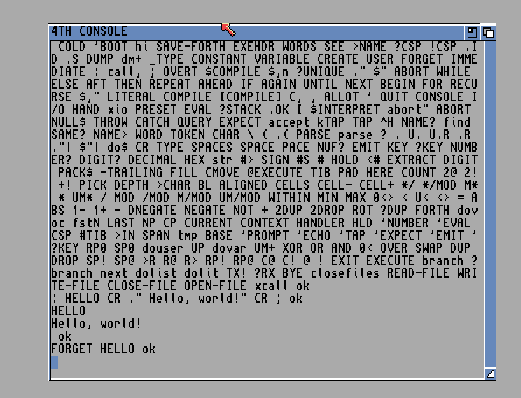

# Very basic toy Forth system for the Commodore Amiga

This is my first and last Forth system I ever wrote for the Commodore Amiga when I was in the mood to create a programming language of some kind for my Amiga.
At that time I read a lot about Forth systems and how simple is it can be to implement, so this is my attempt to prove for myself that this might be true.

Like I mentioned, the Forth system is very basic there is no .f file at all, everything I have implemented as this single mc68000 assembly with some helper macros.
But at least if you created something that is might be useful, and you want to save it for the future, you can do that with SAVE-FORTH word, this will generate a complete new forth executable that include your own words. Next time you want to continue the work you just have to execute that file.

For the available words you can enter `WORDS`, this should list all the words currently available including yours if there is any, and you can delete the word with `FORGET <word>`

Important! You have to enter words with all CAPITAL letters, so you have to use `WORDS` instead of just `words`.

Have fun!



## How to make the initial build

You will need vasm and vlink (see the link below)

```
make
```

This will create `AMIGA_ROOT` folder with `s/startup-sequence` to start `4th` automatically.

## How to run


```
make run
```

Note that for this to work you must have the correct Amiga ROM file(s) in the `rom` folder. E.g. `rom/kickstart_v2.04.rom`. I don't think so I have the right to distribute that in any form.
And excellent FS-UAE Amiga emulator, or a real Amiga :-)


---

Used tools

* http://www.compilers.de/vasm.html
* http://www.compilers.de/vlink.html
* https://fs-uae.net/
